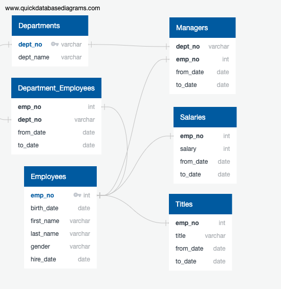
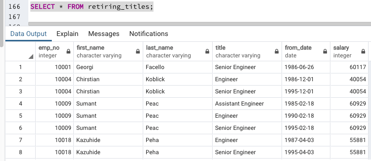
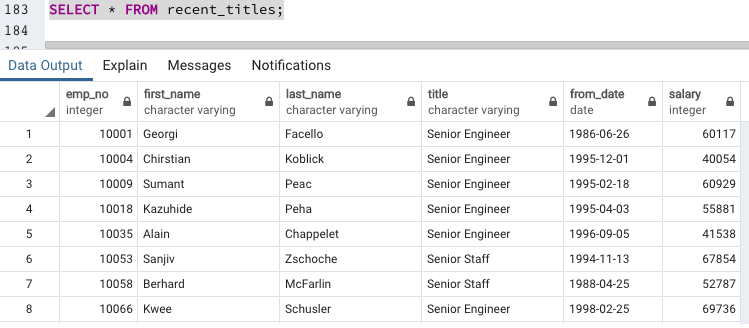
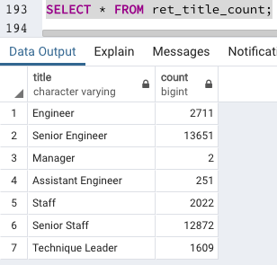
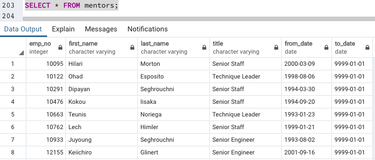

# Pewlett Hackard Analysis
## Challenge Overview
Pewlett Hackard is preparing for a large amount of its employees to retire. From 6 given tables of employee data, we created an ERD and used SQL to perform the following queries.
1. Create a list of current employees eligible for retirement with titles.
2. Filter the list to include only the most recent titles.
3. Create a table with the count for the number of each title that is possibly retiring.
4. Create a table of possible mentors who are current employees born between 1/1/65 and 12/31/65.

## Resources
- Data sources: departments.csv, dept_emp.csv, dept_manager.csv, employees.csv, salaries.csv, titles.csv
- Software: QuickDBD, pgAdmin 4, SQL

## Challenge Tables
Looking at the given data, the it was determined that emp_no and dept_no were Primary Keys in the Employees and Departments tables, respectively. The relationships were mapped in an ERD.

1. Code to create the list of current employees eligible for retirement with their titles:

--Create new table containing titles of possible retirees  
SELECT ce.emp_no, ce.first_name, ce.last_name, titles.title, titles.from_date, salaries.salary  
INTO retiring_titles  
FROM titles  
RIGHT JOIN current_emp AS ce ON titles.emp_no = ce.emp_no  
LEFT JOIN salaries ON ce.emp_no = salaries.emp_no;  
SELECT * FROM retiring_titles;  

2. Code to exclude duplicates

-- Exclude rows of data containing duplicate names to get most recent title  
SELECT emp_no, first_name, last_name, title, from_date, salary  
INTO recent_titles  
	FROM(  
	SELECT emp_no, first_name, last_name, title, from_date,	salary,  
	ROW_NUMBER() OVER (PARTITION BY (emp_no) ORDER BY from_date DESC)  
	FROM retiring_titles) AS tmp  
WHERE row_number = 1;  
SELECT * FROM recent_titles;  

3. Code for table with count of number of each title retiring

-- How many employees share the same title?  
SELECT  
	title,  
	count(\*\)  
INTO ret_title_count  
FROM recent_titles  
GROUP BY title  
HAVING count(\*\) > 1;  
SELECT * FROM ret_title_count;  

4. Code for table of possible mentors

-- Who's Ready for a Mentor? Create a new table with employees with birth date between 1/1/65-12/31/65  
SELECT e.emp_no, e.first_name, e.last_name, titles.title, titles.from_date, titles.to_date  
INTO mentors  
FROM employees as e  
INNER JOIN titles ON e.emp_no = titles.emp_no  
WHERE (e.birth_date BETWEEN '1965-01-01' AND '1965-12-31')  
AND (titles.to_date = '9999-01-01')  
ORDER BY e.emp_no;  
SELECT * FROM mentors;  

## Challenge Summary
Looking at the tables, we can see that 33,118 employees are eligible for retirement based on a birth date between 01/01/52 and 12/31/55 and hire dates between 01/01/85 and 12/31/88. The largest group eligible to retire is Senior Engineers with 13,651, followed by the Senior Staff with 12,872. Only 2 managers are eligible for retirement, but this may be significant because other queries showed that there are very few managers.

Based on birthdates between 01/01/65 and 12/31/65, there are currently 1549 employees eligible for the mentorship program.

Further analysis is definitely needed to determine if there are really only 5 managers in the company. Also, the company needs to look into the salaries to contradict the finding that there have been no raises in the company. It may also be worthwhile to determine if there are any employees who were born between 1952 and 1955, but were hired later than 1988, because they would still meet the age requirement for retirement and possibly came to work with the company later in their careers.
